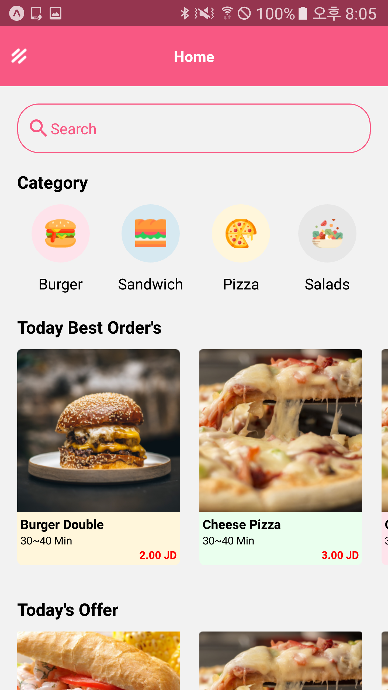
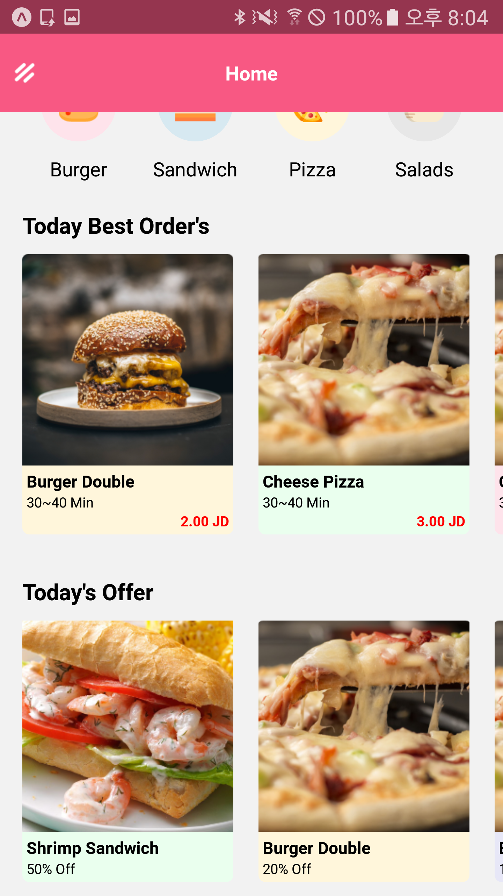
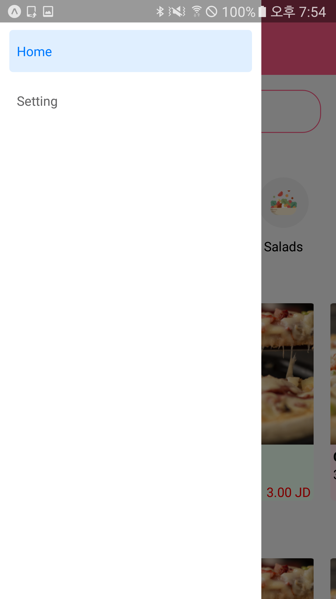

# neko-foodapp
React Native with expo, Front UI

## Init
- yarn add @react-navigation/native
- expo install react-native-gesture-handler react-native-reanimated react-native-screens react-native-safe-area-context @react-native-community/masked-view

## Drawer navi
- yarn add @react-navigation/drawer
- const Drawer = createDrawerNavigator()

## Tree
* Drawer.Navigator
    * Home (HomeScreen)
    * Setting (SettingScreen)

## Designed by
- https://www.uplabs.com/posts/food-app-concept-3e9df68b-5302-4232-8c38-ec5080c2e800

## Result Capture
|Home|Home2|Menu|
|:---:|:---:|:---:|
||||